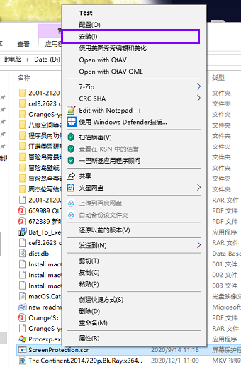
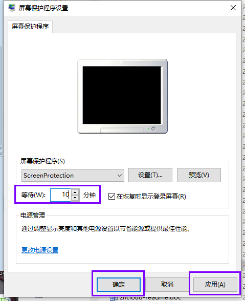
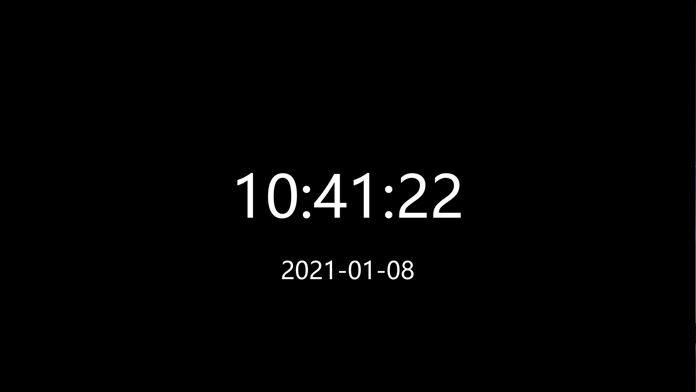

# TimeProtection
一款极简风的仅显示时间与日期的支持多屏的Windows屏幕保护程序。

### 编译环境

* Qt Creator 4.3.0 Community
* Desktop Qt 5.9.0 MinGW 32bit

### 使用

（1）下载bin目录下的ScreenProtection.scr

（2）右键安装

（3）设置等待时间（自动开启屏保的时间），点击应用，点击确定

（4）鼠标和键盘达到设置的时间没有操作的话就会显示当前时间，适合午觉的时候醒来看屏幕时间，具体界面可以点击预览查看

### 效果图

